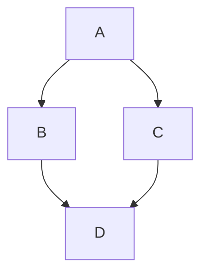

# Firefly 学术博客搭建教程

基于 **Astro 6 + Svelte 5 + Tailwind CSS 4** 的现代化学术博客主题。

---

## 目录

1. [技术栈概览](#1-技术栈概览)
2. [快速开始](#2-快速开始)
3. [项目结构](#3-项目结构)
4. [核心配置](#4-核心配置)
5. [内容管理](#5-内容管理)
6. [布局与导航](#6-布局与导航)
7. [侧边栏与组件](#7-侧边栏与组件)
8. [个性化定制](#8-个性化定制)
9. [特色功能](#9-特色功能)
10. [构建与部署](#10-构建与部署)

---

## 1. 技术栈概览

| 领域 | 技术选型 |
|------|----------|
| 框架 | Astro 6.4.4（静态站点生成 + SSR） |
| UI 组件 | Svelte 5（交互式组件） |
| 样式 | Tailwind CSS v4 + Stylus（CSS 变量 + 主题系统） |
| 内容 | MDX + Markdown + Astro Content Layer v5 |
| 搜索 | Pagefind（静态全文搜索） |
| 主题 | 亮/暗双主题 + 跟随系统 |
| 代码高亮 | Expressive Code（行号、折叠、语言徽章） |
| 数学公式 | KaTeX（`rehype-katex` + `remark-math`） |
| 图表 | Mermaid + PlantUML |
| 页面切换 | SWUP（无刷新导航 + 过渡动画） |
| 图标 | Iconify（Material Symbols, Font Awesome, Simple Icons 等） |
| 部署 | Cloudflare Pages / 任意静态托管 |

---

## 2. 快速开始

### 环境要求

- **Node.js** >= 18
- **pnpm** >= 9（项目强制使用 pnpm）

### 安装

```bash
# 克隆项目
git clone <你的仓库地址>
cd academic-blog-astro

# 安装依赖
pnpm install

# 启动开发服务器
pnpm dev
```

访问 `http://localhost:4321` 即可预览。

### 常用命令

| 命令 | 说明 |
|------|------|
| `pnpm dev` | 启动开发服务器 |
| `pnpm build` | 构建生产版本（生成图标 → LQIP → Astro 构建 → Pagefind 索引） |
| `pnpm preview` | 预览构建产物 |
| `pnpm check` | Astro 类型检查 |
| `pnpm format` | Biome 格式化代码 |
| `pnpm lint` | Biome 检查代码 |
| `pnpm new-post` | 交互式创建新文章 |

---

## 3. 项目结构

```
academic-blog-astro/
├── astro.config.mjs    # Astro 核心配置（集成、插件、构建）
├── svelte.config.js    # Svelte 配置
├── tailwind.config.mjs # Tailwind 配置
├── tsconfig.json       # TypeScript 配置（含路径别名）
├── biome.json          # Biome 格式化/ lint 配置
├── wrangler.jsonc      # Cloudflare Workers 配置
├── package.json        # 依赖和脚本
├── pnpm-lock.yaml
├── public/             # 静态资源（favicon, gallery 图片等）
├── scripts/            # 工具脚本（生成图标、LQIP、新文章）
├── src/
│   ├── config/         # ★ 所有配置集中在此（25 个配置文件）
│   ├── content/        # ★ 内容集合（posts + spec 页面）
│   ├── pages/          # ★ 路由页面
│   ├── layouts/        # 布局组件（Layout + MainGridLayout）
│   ├── components/     # UI 组件（Svelte + Astro）
│   ├── i18n/           # 国际化（5 种语言）
│   ├── plugins/        # 自定义 remark/rehype 插件
│   ├── styles/         # 样式文件（CSS + Stylus）
│   ├── types/          # TypeScript 类型定义
│   └── utils/          # 工具函数
└── dist/               # 构建输出
```

### 路径别名

| 别名 | 映射路径 |
|------|----------|
| `@/` | `src/` |
| `@components/` | `src/components/` |
| `@layouts/` | `src/layouts/` |
| `@utils/` | `src/utils/` |
| `@i18n/` | `src/i18n/` |
| `@constants/` | `src/constants/` |
| `@assets/` | `src/assets/` |

---

## 4. 核心配置

所有配置集中在 `src/config/` 目录下，通过 `src/config/index.ts` 统一导出。

### 4.1 站点配置 — `src/config/siteConfig.ts`

这是最核心的配置文件：

```typescript
export const siteConfig: SiteConfig = {
  // 基本信息
  title: "王忠亮的博客",
  subtitle: "软件工程 · 技术分享 · 学习笔记",
  site_url: "https://wzl12345.pages.dev",
  lang: "zh_CN",
  timezone: "Asia/Shanghai",
  siteStartDate: "2026-02-05",

  // 主题色（色相值）
  themeColor: {
    hue: 25,           // 暖橙色，0-360
    fixed: false,      // false 则每次访问随机
    defaultMode: "system", // light | dark | system
  },

  // 页面宽度
  pageWidth: 100,      // rem

  // 文章卡片样式
  card: {
    border: true,
    followTheme: false, // 卡片色相是否跟随主题色
  },

  // 页面开关（false 则隐藏对应页面和导航）
  pages: {
    friends: true,
    sponsor: false,
    guestbook: true,
    bangumi: true,
    gallery: true,
  },

  // 文章列表布局
  postListLayout: {
    defaultMode: "list", // list | grid | masonry
    showTags: true,
    allowSwitch: true,
    masonry: false,
  },

  // 分页
  pagination: { postsPerPage: 10 },

  // 统计与分析
  analytics: {
    google: { id: "", enabled: false },
    microsoftClarity: { id: "", enabled: false },
    umami: { url: "", id: "", enabled: false },
    "51la": { id: "", enabled: false },
  },

  // 图片优化
  imageOptimization: {
    formats: "webp",   // webp | avif | both
    quality: 85,
  },

  // Callout 提示框主题
  rehypeCallouts: { theme: "github" },

  // 文章最后修改时间
  showLastModified: true,
  outdatedThreshold: 30, // 超过 30 天标记为"可能已过时"

  // OG 图片和分享海报
  generateOgImages: false,
  sharePoster: true,

  // 追番设置
  bangumi: {
    userId: "1143164",
    mode: "dynamic",   // static | dynamic
  },
};
```

### 4.2 导航栏配置 — `src/config/navBarConfig.ts`

```typescript
// 导航链接结构
links: [
  { preset: "home" },          // 首页（图标 + 文字）
  {
    preset: "articles",        // 文章（下拉菜单）
    children: [
      { preset: "archive" },   // 归档
      { preset: "categories" },// 分类
      { preset: "tags" },      // 标签
    ],
  },
  {
    preset: "my",              // 我的（下拉菜单）
    children: [
      { preset: "bangumi" },
      { preset: "guestbook" },
      { preset: "gallery" },
    ],
  },
  {
    preset: "about",           // 关于（下拉菜单）
    children: [
      { preset: "about" },     // /about/
      { preset: "sponsor" },   // /sponsor/（需 pages.sponsor = true）
      { preset: "friends" },   // /friends/
    ],
  },
  { text: "友链", href: "/friends/" }, // 自定义链接
],

search: { method: "PageFind" },
```

### 4.3 个人资料配置 — `src/config/profileConfig.ts`

```typescript
export const profileConfig: ProfileConfig = {
  avatar: "https://www.gravatar.com/avatar/你的邮箱MD5?s=512", // Gravatar 头像
  name: "王忠亮",
  bio: "在每一个无名的日子里，倾我所有去努力。",
  // 社交链接
  links: [
    { icon: "fa7-brands:github", name: "GitHub", url: "https://github.com/..." },
    { icon: "fa7-regular:envelope", name: "Email", url: "mailto:..." },
    { icon: "fa7-solid:rss", name: "RSS", url: "/rss.xml?action=feed" },
  ],
};
```

### 4.4 评论系统 — `src/config/commentConfig.ts`

支持多种评论系统，可切换：

```typescript
export const commentConfig: CommentConfig = {
  type: "none", // "none" | "twikoo" | "waline" | "giscus" | "disqus" | "artalk"
  twikoo: { envId: "https://xxx.twikoo.com" },
  waline: { serverURL: "https://xxx.waline.app" },
  giscus: {
    repo: "owner/repo",
    repoId: "",
    category: "Announcements",
    categoryId: "",
    mapping: "pathname",
    strict: "0",
    reactionsEnabled: "1",
    emitMetadata: "0",
    inputPosition: "top",
    lang: "zh-CN",
  },
  disqus: { shortname: "" },
  artalk: { server: "https://xxx.artalk.app", site: "默认站点" },
};
```

### 4.5 壁纸配置 — `src/config/backgroundWallpaper.ts`

三种壁纸模式：

```typescript
export const backgroundWallpaperConfig: BackgroundWallpaperConfig = {
  mode: "banner",    // "banner" | "fullscreen" | "overlay" | "none"
  switchable: true,  // 允许用户切换

  // Banner 模式配置
  banner: {
    position: "0% 20%",
    carousel: { enable: false, interval: 10 }, // 轮播
  },

  // 全屏背景
  fullscreen: { position: "center" },

  // 覆盖层
  overlay: {
    zIndex: -1,
    opacity: 0.8,
    blur: 10,
    cardOpacity: 0.5,
  },

  // 图片源（桌面端 + 移动端各 6 张）
  src: {
    desktop: [
      "assets/images/DesktopWallpaper/01.jpg",
      // ...
    ],
    mobile: [
      "assets/images/MobileWallpaper/01.jpg",
      // ...
    ],
  },

  // 通用设置
  common: {
    dimOpacity: 0.2,             // 遮罩透明度
    homeText: "在每一个无名的日子里，倾我所有去努力。",
    homeTextTypewriter: true,    // 打字机效果
    navbarTransparent: "semi",   // "none" | "semi" | "full" | "semifull"
    waves: true,                 // 波浪动画
    gradient: true,              // 渐变叠加
  },
};
```

### 4.6 更多配置

- **`expressiveCodeConfig.ts`** — 代码高亮主题和插件设置
- **`fontConfig.ts`** — 自定义字体（内置 Misans、Inter、Zen Maru Gothic 等）
- **`musicConfig.ts`** — 音乐播放器（Meting API / 网易云歌单）
- **`commentConfig.ts`** — 评论系统
- **`effectsConfig.ts`** — Sakura 樱花飘落效果
- **`pioConfig.ts`** — 看板娘（Spine / Live2D）
- **`plantumlConfig.ts`** — PlantUML 服务器设置
- **`footerConfig.ts`** — 页脚自定义 HTML
- **`adConfig.ts`** — 广告位配置
- **`announcementConfig.ts`** — 公告栏
- **`licenseConfig.ts`** — 文章许可协议（默认 CC BY-NC-SA 4.0）
- **`friendsConfig.ts`** — 友链列表
- **`galleryConfig.ts`** — 图集配置
- **`sponsorConfig.ts`** — 赞助页面
- **`coverImageConfig.ts`** — 文章封面图（随机封面 API / 本地图片）

---

## 5. 内容管理

### 5.1 内容集合

使用 Astro v5 Content Layer API：

```typescript
// src/content.config.ts
import { defineCollection, z } from "astro:content";

const posts = defineCollection({
  loader: glob({ pattern: "**/*.{md,mdx}", base: "src/content/posts" }),
  schema: z.object({
    title: z.string(),
    published: z.date(),
    updated: z.date().optional(),
    draft: z.boolean().optional(),
    description: z.string().optional(),
    image: z.string().optional(),        // 封面图
    tags: z.array(z.string()).optional(),
    category: z.string().optional(),
    lang: z.string().optional(),         // 文章语言
    pinned: z.boolean().optional(),      // 置顶
    // 其他元数据...
  }),
});
```

### 5.2 创建文章

在 `src/content/posts/` 下创建 `.md` 或 `.mdx` 文件：

```markdown
---
title: "我的第一篇博客"
published: 2026-06-01
tags: ["Astro", "博客"]
category: "技术"
description: "这是一篇示例文章"
image: "/images/cover.jpg"     # 可选封面图
pinned: false                  # 是否置顶
draft: false                   # 草稿模式
---

这里是文章正文，支持 **Markdown** 和 *MDX* 语法。

## 二级标题

数学公式：$E = mc^2$

代码块：
```python
def hello():
    print("Hello, Firefly!")
```

> 这是一条引用
```

使用交互式命令创建新文章：

```bash
pnpm new-post
```

### 5.3 特殊页面

在 `src/content/spec/` 下创建：

| 文件 | 路由 | 说明 |
|------|------|------|
| `about.md` | `/about/` | 关于页面 |
| `friends.mdx` | `/friends/` | 友链页面（支持嵌入组件） |
| `guestbook.md` | `/guestbook/` | 留言板 |

### 5.4 文章 Frontmatter 字段

| 字段 | 类型 | 必填 | 说明 |
|------|------|------|------|
| `title` | string | ✅ | 文章标题 |
| `published` | date | ✅ | 发布日期 |
| `updated` | date | ❌ | 更新日期 |
| `draft` | boolean | ❌ | 草稿状态 |
| `description` | string | ❌ | 摘要（不填则自动截取首段） |
| `image` | string | ❌ | 封面图片路径 |
| `tags` | string[] | ❌ | 标签列表 |
| `category` | string | ❌ | 分类 |
| `lang` | string | ❌ | 语言（覆盖站点语言） |
| `pinned` | boolean | ❌ | 是否置顶 |
| `author` | string | ❌ | 作者（覆盖默认） |
| `sourceLink` | string | ❌ | 原文链接（转载标注） |
| `licenseName` | string | ❌ | 自定义许可协议名称 |
| `licenseUrl` | string | ❌ | 自定义许可协议链接 |
| `comment` | boolean | ❌ | 是否启用评论（默认 true） |
| `password` | string | ❌ | 加密密码（加密文章） |
| `passwordHint` | string | ❌ | 密码提示 |
| `prevTitle` | string | ❌ | 自定义上一篇标题 |
| `prevSlug` | string | ❌ | 自定义上一篇链接 |
| `nextTitle` | string | ❌ | 自定义下一篇标题 |
| `nextSlug` | string | ❌ | 自定义下一篇链接 |

---

## 6. 布局与导航

### 6.1 布局层级

```
Layout.astro (HTML 外壳)
  └── MainGridLayout.astro (壁纸 + 导航 + 侧栏 + 内容网格)
       ├── Navbar (导航栏)
       ├── Wallpaper (Banner / 全屏 / 叠加背景)
       ├── Content Slot (页面内容)
       ├── SideBar (左/右/移动端底部)
       └── Footer (页脚)
```

### 6.2 导航栏配置

在 `src/config/navBarConfig.ts` 中配置导航链接。支持：

- **顶部链接** — 直接显示在导航栏
- **下拉菜单** — 通过 `children` 实现嵌套
- **搜索** — 使用 PageFind 全文搜索
- **右侧控件** — 主题切换、壁纸切换、音乐播放器

导航栏行为：

```typescript
stickyNavbar: true,      // 粘性导航栏
widthFull: false,        // 是否全宽
menuAlign: "center",     // 菜单对齐方式
navbarTransparent: "semi", // 透明模式
```

---

## 7. 侧边栏配置

在 `src/config/sidebarConfig.ts` 中配置：

```typescript
export const sidebarConfig: SidebarLayoutConfig = {
  position: "both",        // "left" | "right" | "both" | "none"
  tabletSidebar: "left",   // 平板设备显示哪一侧
  showBothSidebarsOnPostPage: true,

  // 左侧栏（从上到下）
  left: {
    top: ["profile", "announcement"],
    sticky: ["music", "categories", "tags", "advertisement"],
  },

  // 右侧栏
  right: {
    top: ["siteStats"],
    sticky: ["calendar", "sidebarTOC", "advertisement"],
  },

  // 移动端底部
  mobileBottom: ["profile", "announcement", "music", "categories", "tags", "siteStats"],
};
```

可用的侧边栏组件：

| 组件 | 说明 |
|------|------|
| `profile` | 个人资料卡片（头像 + 社交链接） |
| `announcement` | 公告栏 |
| `music` | 音乐播放器 |
| `categories` | 分类列表（可折叠） |
| `tags` | 标签云（可折叠） |
| `siteStats` | 站点统计（文章数、标签数、总字数、运行天数） |
| `calendar` | 日历热力图 |
| `sidebarTOC` | 文章目录（仅文章页显示） |
| `advertisement` | 广告位 |

---

## 8. 个性化定制

### 8.1 主题色

修改 `siteConfig.themeColor.hue`（0-360）。色相值决定：

- 导航栏高亮色
- 链接颜色
- 卡片边框色
- 按钮主题色

设置 `fixed: false` 则每次访问随机生成色相。

### 8.2 壁纸

1. 将图片放入 `src/assets/images/DesktopWallpaper/` 和 `MobileWallpaper/`
2. 修改 `backgroundWallpaper.ts` 中的 `src.desktop` 和 `src.mobile` 路径
3. 选择模式：`banner`（横幅）、`fullscreen`（全屏）、`overlay`（叠加）

### 8.3 自定义字体

在 `fontConfig.ts` 中启用：

```typescript
enable: true,
preload: true,
family: "misans-regular",  // 内置选项
```

内置字体：`system`、`zen-maru-gothic`、`inter`、`misans-normal`、`misans-regular`、`misans-semibold`

字体文件需放入 `src/assets/fonts/` 目录。

### 8.4 代码高亮

在 `expressiveCodeConfig.ts` 中配置：

```typescript
darkTheme: "one-dark-pro",
lightTheme: "one-light",
pluginCollapsible: { enable: true, lineThreshold: 15, previewLines: 8, defaultCollapsed: true },
pluginLanguageBadge: { enable: false },
```

支持的 Expressive Code 插件：折叠代码块、行号、语言徽章。

### 8.5 国际化

在 `src/i18n/` 中维护翻译：

| 文件 | 语言 |
|------|------|
| `zh_CN.ts` | 简体中文（最完善） |
| `zh_TW.ts` | 繁体中文 |
| `en.ts` | 英文 |
| `ja.ts` | 日文 |
| `ru.ts` | 俄文 |

所有 UI 文本通过 `i18nKey` 枚举引用，添加新语言只需新建翻译文件并注册。

---

## 9. 特色功能

### 9.1 Markdown 扩展语法

**Callout 提示框：**

```markdown
> [!NOTE] 标题
> 这是一条笔记内容

> [!WARNING] 警告
> 请注意这个重要事项

> [!TIP] 提示
> 一个小技巧

> [!IMPORTANT] 重要
> 必须注意的内容
```

**图片网格：**

```markdown
::image-grid


::
```

**GitHub 仓库卡片：**

```markdown
::github{repo="owner/repo-name"}
```

**数学公式（KaTeX）：**

```markdown
行内公式：$E = mc^2$

块级公式：
$$
\int_{-\infty}^{\infty} e^{-x^2} dx = \sqrt{\pi}
$$

化学方程式：$\ce{2H2 + O2 -> 2H2O}$（需 mhchem 扩展）
```

**Mermaid 图表：**

````markdown

````

**PlantUML 图表：**

````markdown

````

**加密文章：**

在 frontmatter 设置 `password` 字段，读者需要输入密码才能查看内容。

### 9.2 音乐播放器

基于 Meting API（默认使用网易云歌单）：

```typescript
// musicConfig.ts
mode: "meting",
server: "netease",
type: "playlist",
id: "10046455237",  // 歌单 ID
volume: 0.7,
showLyrics: true,    // 显示歌词
playMode: "list",    // list | random | single
```

支持显示在导航栏或侧边栏。

### 9.3 追番页面

配置 Bangumi 用户 ID，自动同步追番数据：

```typescript
bangumi: {
  userId: "1143164",
  mode: "dynamic",  // dynamic 实时获取 | static 构建时获取
}
```

页面路由：`/bangumi/`，需 `pages.bangumi = true`。

### 9.4 图集

在 `galleryConfig.ts` 中配置相册：

```typescript
albums: [
  {
    name: "firefly-2026",
    title: "Firefly 2026",
    description: "2026 年的回忆",
    columnWidth: 240,
    password: "",      // 可选密码
  },
],
```

图片放入 `public/gallery/<album_name>/` 目录。

### 9.5 搜索

基于 Pagefind 的静态全文搜索：

- 构建时自动索引所有文章
- 支持模糊搜索、中文分词
- 搜索结果包括标题、摘要、路径
- 按相关度排序

### 9.6 统计与分析

支持四种分析服务（均在 `siteConfig.analytics` 中配置）：

- Google Analytics
- Microsoft Clarity（热力图）
- Umami（自托管）
- 51la

### 9.7 赞助页面

在 `sponsorConfig.ts` 中配置收款方式：

```typescript
methods: [
  { name: "支付宝", icon: "...", qrCode: "/images/alipay.jpg" },
  { name: "微信支付", icon: "...", qrCode: "/images/wechat.jpg" },
  { name: "ko-fi", name_en: "Ko-fi", url: "https://ko-fi.com/..." },
  { name: "爱发电", name_en: "AFDIAN", url: "https://afdian.com/..." },
],
```

### 9.8 看板娘

支持两种看板娘系统：

- **Spine Model** — 使用 JSON 格式的 Spine 动画模型
- **Live2D Widget** — 基于 `l2d-widget` 库，支持点击交互

在 `pioConfig.ts` 中启用。

### 9.9 分享海报

文章页自动生成分享海报（基于 `satori` + `sharp`），包含标题、作者、日期等信息的社交分享图片。

---

## 10. 构建与部署

### 10.1 构建

```bash
pnpm build
```

构建流程：

1. `generate-icons.js` — 生成图标文件
2. `generate-lqips.ts` — 生成图片低质量占位符（LQIP）
3. `astro build` — Astro 构建静态站点
4. `pagefind --site dist` — 生成搜索索引

产物输出到 `dist/` 目录。

### 10.2 部署到 Cloudflare Pages

项目已内置 Cloudflare 适配器和配置：

```bash
# 设置环境变量以启用 Cloudflare 适配器
$env:CF_WORKERS = "true"

# 构建
pnpm build

# 部署（使用 wrangler）
npx wrangler pages deploy dist
```

或通过 Cloudflare Pages Dashboard 连接 Git 仓库自动部署。

### 10.3 部署到其他平台

如果不需要 Cloudflare SSR，构建产物 `dist/` 是纯静态文件，可直接部署到：

- Vercel
- Netlify
- GitHub Pages
- 任意 Nginx / Apache 服务器
- 对象存储（OSS / S3）

---

## 附录

### A. 自定义插件

项目内置了丰富的 remark/rehype 插件，位于 `src/plugins/`：

| 插件 | 类型 | 功能 |
|------|------|------|
| `remark-reading-time` | remark | 计算阅读时间 |
| `remark-excerpt` | remark | 自动提取摘要 |
| `remark-image-grid` | remark | 图片网格语法 |
| `remark-directive-rehype` | remark | 通用指令解析 |
| `remark-mermaid` | remark | Mermaid 代码块 |
| `remark-plantuml` | remark | PlantUML 代码块 |
| `rehype-katex` | rehype | LaTeX 渲染 |
| `rehype-callouts` | rehype | 提示框 |
| `rehype-mermaid` | rehype | Mermaid 渲染 |
| `rehype-plantuml` | rehype | PlantUML 渲染 |
| `rehype-figure` | rehype | 图片 `<figure>` 包裹 |
| `rehype-external-links` | rehype | 外链新窗口 |
| `rehype-email-protection` | rehype | 邮箱保护 |
| `rehype-component-github-card` | rehype | GitHub 卡片组件 |

### B. 性能优化

- 图片自动优化（WebP/AVIF 格式转换 + LQIP 占位）
- CSS 代码分割
- 资源内联（< 4KB）
- 构建时移除 console.log 和 debugger
- SWUP 预加载 + 缓存
- 可选的 Rust 编译器

### C. 相关资源

- [Astro 文档](https://docs.astro.build)
- [Svelte 5 文档](https://svelte.dev/docs/svelte/overview)
- [Tailwind CSS v4 文档](https://tailwindcss.com/docs/installation)
- [Expressive Code 文档](https://expressive-code.com/)
- [Pagefind 文档](https://pagefind.app/)
- [SWUP 文档](https://swup.js.org/)
